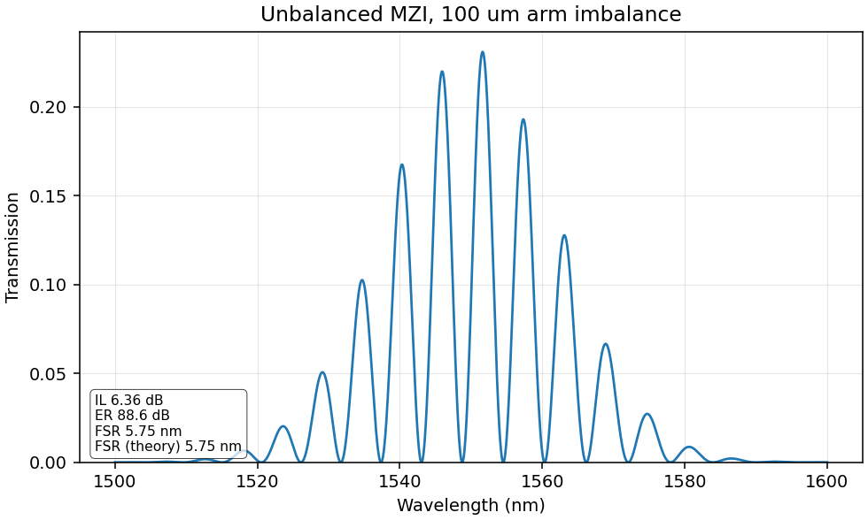
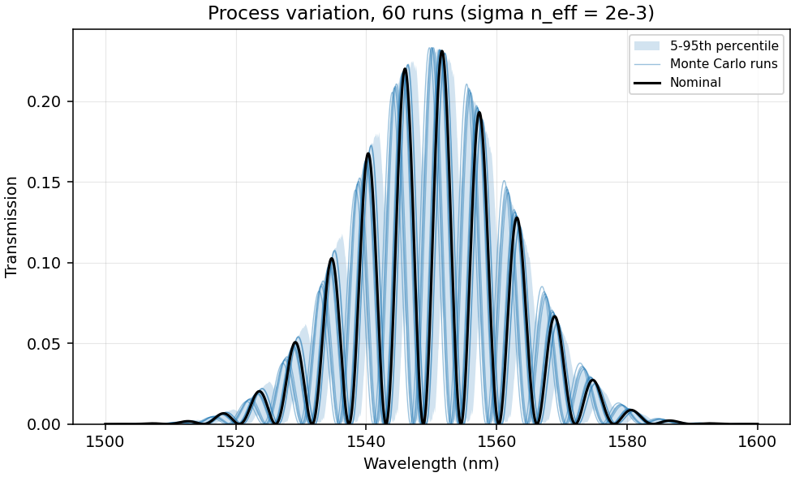
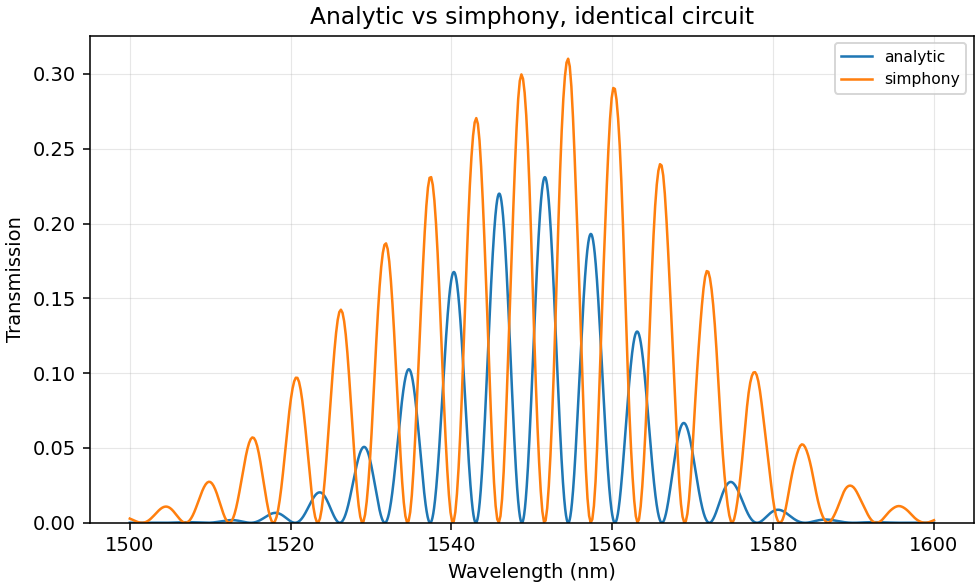

# MachDesigner

[](https://github.com/prmtv-mind/machdesigner/actions/workflows/ci.yml)
[](https://www.python.org/)
[](LICENSE)

Design, simulate, and analyse silicon photonic circuits from a GUI, a command
line, or Python. The worked example is a Mach-Zehnder interferometer on a
silicon-on-insulator strip waveguide.



Two independent engines solve the same circuit:

- **analytic** (default) — closed-form transfer functions in NumPy. Runs in
  milliseconds, installs anywhere, and its predictions are checked against
  textbook interferometer relations in CI.
- **simphony** (optional) — [simphony](https://github.com/BYUCamachoLab/simphony)
  driving the SiEPIC compact models, which are built from measured
  S-parameters.

They agree on free spectral range to better than 1 % while making completely
different assumptions, which is the point: the closed form keeps the physics
inspectable, and simphony keeps it honest.

## Install

```bash
pip install machdesigner              # core library + CLI
pip install 'machdesigner[gui]'       # adds the Qt designer
pip install 'machdesigner[simphony]'  # adds the SiEPIC backend
pip install 'machdesigner[all]'       # everything
```

From a checkout:

```bash
git clone https://github.com/prmtv-mind/machdesigner
cd machdesigner
pip install -e '.[all,dev]'
```

## Command line

```bash
# default 150/50 um MZI: plot it, save the trace
machdesigner sweep --long 150 --short 50 --plot mzi.png --csv mzi.csv

# any supported component chain
machdesigner sweep --components gc-input,waveguide:250,gc-output

# 200-run process-variation study, reproducible
machdesigner monte-carlo --runs 200 --seed 7 --plot yield.png

# run the same circuit through every installed engine
machdesigner compare --plot compare.png
```

```
$ machdesigner sweep --long 150 --short 50
sweep complete
  circuit        : Mach-Zehnder interferometer: Grating coupler (input) -> Y-splitter
                   -> Waveguide (150 um) -> Waveguide (50 um) -> Y-combiner
                   -> Grating coupler (output)
  backend        : analytic
  insertion loss : 6.364 dB
  extinction     : 88.69 dB
  free spectral range: 5.747 nm
  theory             : 5.752 nm (0.10% from measured)
```

Lengths are micrometres, wavelengths nanometres, power milliwatts. The library
itself is strictly SI; the CLI converts at the boundary.

## Python

```python
from machdesigner import Circuit, SweepSpec, simulate

circuit = Circuit.mzi(long_arm_m=150e-6, short_arm_m=50e-6)
result = simulate(circuit, SweepSpec(start_m=1500e-9, stop_m=1600e-9, points=4000))

print(f"{result.insertion_loss_db:.2f} dB insertion loss")
print(f"{result.free_spectral_range_m() * 1e9:.3f} nm free spectral range")

result.write_csv("mzi.csv")
```

Build a circuit component by component, and get a specific error when it does
not make sense:

```python
>>> Circuit.from_components([Component.waveguide(50e-6), Component.of("gc-output")])
CircuitError: a circuit must start with an input grating coupler, but slot 1
holds Waveguide (50 um)
Set the first component to 'Grating coupler (input)'.
```

Process variation, with a fixed seed so the study is reproducible:

```python
from machdesigner import MonteCarloSpec, run_monte_carlo

mc = run_monte_carlo(circuit, spec, MonteCarloSpec(runs=200, seed=7))
print(mc.fsr_statistics_m())      # mean, std, min, max across the ensemble
low, high = mc.percentile_band()  # 5th-95th percentile envelope
```



At realistic process variation the envelope stays put while the fringes wander
over a full period — the absolute fringe position of an unbalanced MZI is not
manufacturable without trimming, which is why real devices are thermally
tuned. Free spectral range, set by the group index rather than by accumulated
phase, stays tight: a few picometres of spread on 5.75 nm.

## GUI

```bash
machdesigner gui
```

Six component slots, each with its own length field. The circuit is validated
as you edit — the Run button stays disabled, and the message says what is
actually wrong, until the chain makes sense. Plots are embedded and
interactive (pan, zoom, save), and simulations run on a worker thread so the
window stays responsive.

## Physics

The analytic backend implements, for an ideal MZI,

```
T(lam) = cos^2( pi n_eff(lam) dL / lam )
FSR    = lam^2 / (n_g dL)
```

with a dispersive `n_eff(lam)` for a 220 x 500 nm SOI strip waveguide
(`n_g = 4.18` at 1550 nm), 2.4 dB/cm propagation loss, Gaussian grating
couplers (3 dB insertion loss, 40 nm bandwidth), and 50/50 Y-branches.

Full derivations, every default parameter, and an explicit list of the model's
limitations are in [`docs/physics.md`](docs/physics.md). The short version of
the limitations: these are *nominal* models, not a calibrated PDK, so fringe
spacing and envelope shape are trustworthy but absolute fringe positions and
extinction ratios are not.



## Supported circuits

| Topology | Chain |
| --- | --- |
| Straight link | `GC in -> waveguide -> GC out` |
| Mach-Zehnder | `GC in -> Y-split -> waveguide -> waveguide -> Y-combine -> GC out` |

Anything else is rejected with a diagnostic naming the problem. Adding a
topology means adding a signature and a solver in
`src/machdesigner/netlist.py` and `backends/analytic.py` — the GUI and CLI
pick it up without changes.

## Tests

```bash
pytest                      # 109 tests, about 7 seconds
pytest --cov=machdesigner
```

The physics tests check simulation output against independently derived
relations rather than recorded outputs: the cosine-squared law to 1e-12,
`FSR ∝ 1/dL` across a range of imbalances, energy conservation, group index
against a numerical derivative, and agreement between the two backends.

## Project layout

```
src/machdesigner/
  components.py   component types and compact models
  netlist.py      circuit description, validation, topology recognition
  sweep.py        sweep and Monte Carlo specifications
  results.py      result metrics and export
  simulate.py     high-level entry points
  plotting.py     figure builders
  cli.py          command line
  backends/       analytic and simphony engines
  gui/            Qt front end
```

## Relationship to the original

This is a rebuild of an earlier two-file prototype (`source_code.py` and
`pygui.py`). [`CHANGELOG.md`](CHANGELOG.md) lists what changed and why,
including the three bugs the original shipped with: a `savefig` that always
wrote a blank image, a `plt.show()` that froze the GUI, and a script that
crashed on import.

## License

MIT — see [LICENSE](LICENSE).
